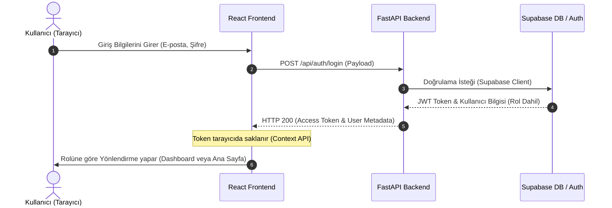

<p align="center">
  
  
  
  
  
  
</p>

---

# 🎟️ CS 308 Online Ticketing Platform

**Sabancı Üniversitesi - CS 308 Yazılım Mühendisliği Projesi**
*Modern, Güvenli ve Ölçeklenebilir Rol Tabanlı Çevrimiçi Bilet Satış Platformu*

Bu repo, projenin **Kimlik Doğrulama (Authentication) ve Yetkilendirme (Authorization)** modülü başta olmak üzere, temel veri tabanı entegrasyonu, rol tabanlı erişim kontrolü, sepet, sipariş, ürün/etkinlik listeleme ve admin yönetim panellerini barındırmaktadır.

---

## 📌 İçindekiler
- [🌟 Öne Çıkan Özellikler](#-öne-çıkan-özellikler)
- [⚙️ Sistem Mimarisi](#%EF%B8%8F-sistem-mimarisi)
- [🛠️ Teknoloji Yığını (Stack)](#%EF%B8%8F-teknoloji-yığını-stack)
- [📂 Proje Yapısı](#-proje-yapısı)
- [🚀 Kurulum ve Çalıştırma](#-kurulum-ve-çalıştırma)
- [🧪 Test Süreci](#-test-süreci)
- [🔑 Varsayılan Test Hesapları](#-varsayılan-test-hesapları)
- [📡 API Endpoints](#-api-endpoints)
- [🛡️ Güvenlik ve Doğrulama Kuralları](#%EF%B8%8F-güvenlik-ve-doğrulama-kuralları)
- [👥 Katkıda Bulunanlar](#-katkıda-bulunanlar)

---

## 🌟 Öne Çıkan Özellikler

*   **🔒 Gelişmiş Kimlik Doğrulama:** Supabase Auth entegrasyonu ile JWT tabanlı oturum yönetimi.
*   **👥 Rol Tabanlı Yönlendirme (RBAC):** Sistemde üç farklı aktör için özel arayüzler ve yetki kontrolleri:
    *   **Customer (Müşteri):** Etkinlikleri arar, filtreler, favori listesi oluşturur ve bilet satın alır.
    *   **Sales Manager (Satış Yöneticisi):** Satış analitiği, dashboard takibi ve fatura yönetimini kontrol eder.
    *   **Product Manager (Ürün Yöneticisi):** Yeni etkinlikler oluşturur, mevcut ürünleri günceller ve siler.
*   **💳 Güvenli Ödeme Arayüzü:** Visa, Mastercard ve Troy kart tiplerine özel dinamik 3D logo ve çevrilebilir interaktif kart görseli içeren ödeme ekranı.
*   **📈 Profesyonel Dashboard:** Satış istatistikleri ve bilet trendlerini takip etmek için grafik arayüzleri.
*   **❤️ İstek Listesi & Yorumlar:** Müşterilerin biletleri favorilerine ekleyebilmesi ve etkinliklere puan/yorum bırakabilmesi.

---

## ⚙️ Sistem Mimarisi

Aşağıdaki şemada, bir kullanıcının sisteme giriş yapma süreci ve rolüne göre FastAPI backend üzerinden yönlendirilme mimarisi gösterilmiştir:



---

## 🛠️ Teknoloji Yığını (Stack)

<table>
  <tr>
    <td valign="top" width="50%">
      <h3>Backend (Sunucu)</h3>
      <ul>
        <li><b>Dil:</b> Python 3.10+</li>
        <li><b>Framework:</b> FastAPI (Asenkron API desteği)</li>
        <li><b>Veri Tabanı:</b> Supabase (PostgreSQL)</li>
        <li><b>Güvenlik & ORM:</b> JWT & Pydantic V2</li>
        <li><b>Sunucu:</b> Uvicorn</li>
        <li><b>Test Arayüzü:</b> Pytest</li>
      </ul>
    </td>
    <td valign="top" width="50%">
      <h3>Frontend (Arayüz)</h3>
      <ul>
        <li><b>Framework:</b> React 18+ (Vite)</li>
        <li><b>Dil:</b> TypeScript</li>
        <li><b>Stil Tasarımı:</b> Tailwind CSS</li>
        <li><b>Veri İletişimi:</b> Axios</li>
        <li><b>Durum Yönetimi:</b> React Context API</li>
        <li><b>Grafik Kütüphaneleri:</b> Recharts</li>
      </ul>
    </td>
  </tr>
</table>

---

## 📂 Proje Yapısı

```bash
cs308-project/
├── backend/                  # Python FastAPI Backend
│   ├── app/
│   │   ├── api/             # API Router/Endpoint'leri (auth, events, orders, vb.)
│   │   ├── core/            # Temel konfigürasyon ve veri tabanı ayarları
│   │   ├── schemas/         # Pydantic veri doğrulama modelleri
│   │   └── services/        # İş mantığı (Business Logic) servisleri
│   ├── main.py              # Uygulama başlangıç noktası
│   ├── requirements.txt     # Python bağımlılık listesi
│   └── .env.example         # Örnek çevre değişkenleri
│
├── frontend/                 # React TypeScript Frontend
│   ├── src/
│   │   ├── components/      # Yeniden kullanılabilir UI bileşenleri (Kartlar, Formlar)
│   │   ├── pages/           # Sayfa bileşenleri (Admin, Dashboard, Events)
│   │   ├── context/         # Auth/Session yönetim bağlamı
│   │   ├── services/        # API servis istekleri
│   │   └── index.css        # Tailwind CSS & global stiller
│   ├── package.json         # Node.js bağımlılık listesi
│   └── vite.config.ts       # Vite konfigürasyonu
│
├── prd.md                    # Proje Gereksinim Dökümanı (PRD)
└── README.md                 # Proje Tanıtım Dosyası
```

---

## 🚀 Kurulum ve Çalıştırma

### 1. Ön Gereksinimler
Sisteminizde aşağıdaki araçların kurulu olduğundan emin olun:
- **Python 3.10+**
- **Node.js 20+**
- Etkin bir **Supabase Hesabı** ve Veri Tabanı

---

### 2. Backend Kurulumu

```bash
# Backend dizinine geçin
cd backend

# Sanal ortam (Virtual Environment) oluşturun ve aktif edin
python3 -m venv venv
source venv/bin/activate  # Windows için: venv\Scripts\activate

# Bağımlılıkları yükleyin
pip install -r requirements.txt

# Çevre değişkenlerini ayarlayın
cp .env.example .env
```

`.env` dosyasını kendi Supabase bilgilerinizle güncelleyin:
```env
SUPABASE_URL=https://your-project-id.supabase.co
SUPABASE_KEY=your-supabase-anon-key
```

FastAPI sunucusunu başlatın:
```bash
uvicorn main:app --reload
```
Backend sunucusu http://localhost:8000 adresinde çalışmaya başlayacaktır.

---

### 3. Frontend Kurulumu

```bash
# Yeni bir terminal sekmesinde frontend dizinine geçin
cd frontend

# Paketleri yükleyin
npm install

# Çevre değişkenlerini ayarlayın
cp .env.example .env
```

Geliştirme sunucusunu başlatın:
```bash
npm run dev
```
Uygulama http://localhost:5173 adresinde ayağa kalkacaktır.

---

## 🧪 Test Süreci

Projede arka uç servisleri `pytest` kullanılarak test edilmektedir. Testleri koşturmak için aşağıdaki komutları kullanabilirsiniz:

```bash
cd backend
source venv/bin/activate
pytest -v
```

### ✅ Kabul Kriterleri (Acceptance Criteria Coverage)

| Test Kodu | Kriter | Durum |
| :--- | :--- | :---: |
| **AC-01** | Geçerli bilgilerle kayıt (Register) işlemi başarılı olmalıdır. |  ✅ |
| **AC-02** | Zaten kayıtlı bir e-posta ile kayıt olmaya çalışıldığında hata verilmelidir. |  ✅ |
| **AC-03** | Doğru kimlik bilgileriyle giriş yapıldığında Supabase oturumu dönmelidir. |  ✅ |
| **AC-04** | Yanlış şifre girildiğinde `401 Unauthorized` hatası alınmalıdır. |  ✅ |
| **AC-05** | Kullanıcı rolüne göre ilgili arayüze otomatik yönlendirilmelidir. |  ✅ |
| **AC-06** | Boş form gönderildiğinde frontend tarafında uyarılar gösterilmelidir. |  ✅ |
| **AC-07** | Şifreler veri tabanında hash'lenmiş şekilde güvenle saklanmalıdır. |  ✅ |
| **AC-08** | Yetkisiz rotalara (örneğin müşteri hesabıyla admin paneline) erişim engellenmelidir. |  ✅ |

---

## 🔑 Varsayılan Test Hesapları

Sistemi doğrudan denemek için aşağıdaki önceden tanımlanmış rollere sahip hesapları kullanabilirsiniz:

| Rol | E-posta | Şifre | Erişim Rotası |
| :--- | :--- | :--- | :--- |
| **👨‍💼 Sales Manager** | `sales@ticketing.com` | `Admin1234!` | `/admin/sales` |
| **👩‍💻 Product Manager** | `product@ticketing.com` | `Admin1234!` | `/admin/products` |
| **👤 Customer** | *Kayıt sayfasından yeni hesap oluşturulabilir.* | - | `/` |

---

## 📡 API Endpoints

FastAPI'nin sağladığı dinamik OpenAPI/Swagger dökümantasyonuna sunucuyu başlattıktan sonra aşağıdaki linklerden erişebilirsiniz:

*   **Interactive Swagger UI:** http://localhost:8000/docs
*   **Alternative ReDoc:** http://localhost:8000/redoc

---

## 🛡️ Güvenlik ve Doğrulama Kuralları

### 🔒 Güvenlik Katmanı
*   **Parola Güvenliği:** Parolalar hiçbir zaman açık metin olarak saklanmaz. Supabase Auth altyapısında hashlenerek korunur.
*   **CORS Ayarları:** Backend API'leri yalnızca yetkilendirilmiş kökenlerden (origins) gelen isteklere izin verecek şekilde yapılandırılmıştır.
*   **Token Kontrolü:** İstekler JWT bearer token'ları ile korunur.

### 📝 Form Doğrulama Kuralları (Validation)
*   **İsim / Soyisim:** En az 2 karakter olmalıdır.
*   **E-posta:** Standart e-posta formatına uygun olmalıdır (`ornek@domain.com`).
*   **Şifre Gücü:** En az 8 karakter, 1 büyük harf ve 1 rakam içermelidir.
*   **Vergi / T.C. Kimlik No:** Tam olarak 11 haneli olmalı ve yalnızca rakamlardan oluşmalıdır.
*   **Adres:** Boş bırakılamaz.

---

## 👥 Katkıda Bulunanlar

*   **CS 308 Proje Grubu** - Sabancı Üniversitesi, 2026

---

## 📄 Lisans

Bu proje Sabancı Üniversitesi **CS 308 (Software Engineering)** dersi kapsamında eğitim ve değerlendirme amaçlı geliştirilmiştir. Tüm hakları saklıdır.
